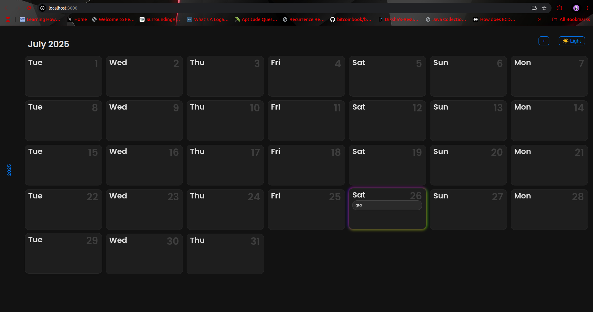

# 🗓️ Minimal Calendar

A sleek and minimalist calendar web application to help users manage daily tasks with a visually intuitive interface. Built using **React** and **Django REST Framework**, this app supports **token-based authentication**, per-user task management, and a stylish dark/light theme toggle.



**🌐 Live Demo:**  
👉 [https://minimal-calender-frontend.onrender.com](https://minimal-calender-frontend.onrender.com)

---

## ✨ Features

- 📆 **Monthly Calendar View** with clickable days  
- ✅ **Task Creation & Completion**  
- 🔐 **User Authentication** (Token-based login/signup)  
- 🌗 **Dark/Light Theme Toggle**  
- 🔒 User-specific task visibility  
- 💡 Minimal and aesthetic UI (neon-glass style auth pages)

---

## 🔧 Tech Stack

### Frontend

- React 19  
- Axios  
- React Router DOM  
- date-fns  
- CSS Modules with themed variables  

### Backend

- Django 5.1  
- Django REST Framework  
- Token Authentication (`rest_framework.authtoken`)  
- SQLite (default)  
- CORS Headers for API access  

---

## 🚀 Setup Instructions

### 1️⃣ Backend (Django)

```bash
git clone <repo-url>
cd backend
python -m venv venv
source venv/bin/activate

pip install -r requirements.txt

# Run migrations and start the server
python manage.py migrate
python manage.py runserver
